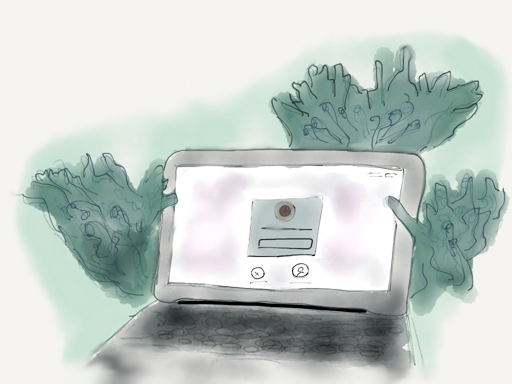

Computers are ecosystem. Tiny unix programs support the workings of massive GUI-based applications, hidden processes spin in tandem to create useful (or useless) heat and information, and deeply buried systems check from time-to-time to return computers to some factory-defined state.

But since we created these artificial jungles of transistors and computation, we’ve also had the virus. Slipping across networks and self-replicating within systems, computer viruses are at one time a stunning example of engineering virtuosity, and a stark reminder of the strengths and weaknesses of the network.

My suspicion is that the computer virus, despite being a product of human creativity like all computational things, is a natural and perhaps necessary part of the networked computational ecosystem. Viruses slow down processes, corrupt data, can cause physical damage (as in the case of [w32.Stuxnet](https://web.archive.org/web/20190612065150/http://www.wired.com/2011/07/how-digital-detectives-deciphered-stuxnet/all/) ), and persist in PRAM and bios chips long after one might think they have started from a blank slate. They can cross ecological boundaries, as in the case of stuxnet’s USB jumping or in the 2006 case of [Apple iPods accidentally shipping with a windows viruses](https://web.archive.org/web/20190612065150/http://www.apple.com/support/windowsvirus/) . They grow more resilient, such as a virus being enabled in the fight against the personal computer’s leucocytes. Viruses enabled with polymorphic or metamorphic engines are set up to obfuscate the lens of anti-virus software, enabling a broader spread and slower meaningful response on the part of those who craft these defenses.

Even with these analogies to the natural world though, the computer virus is a conscious creation on the part of an individual or organization. Something released into the world in order to accomplish a task, to execute some mischief, or to forward to malicious intent. With this frame, how can the virus be something both natural and valuable in a networked and constructed ecosystem?

## Viralmimicracy

I want to explore two very small things: viruses and bacteria. Viruses operate by infecting a host and taking over its mechanisms for reproduction and other purposes. This process can kill the host, or damage them, but often benefit the host through greater overall resilience and other emergent qualities from contact with the viral infection.

In contrast, bacteria are single-celled organisms that thrive in different organic environments, causing a range of effects in the same. For example, bacteria serves as a primary mechanism for enabling decay in biological systems, the same bacteria that help us digest food.

Contemporary human craft often rebels against the notion that these qualities might be positive. In physical products, decay can be manifest through material degradation or obsolescence: the cultural context for the object has shifted. In computational systems, decay is often manifest through informational entropy: the value of information changing, becoming lost, becoming unsearchable, or losings its connection to its network and its context. In most cases, the effect is almost entirely deleterious to the host.

So what happens when we try to create beneficial viruses (which is where I’m going with all of this)? In the mid-90s, there was a hidden battle (of sorts) propagated across millions of systems worldwide. The BLAST virus and the Welchia worm were two viruses with different intentions. [Blast (w32/Lovesan.worm)](<https://web.archive.org/web/20190612065150/http://en.wikipedia.org/wiki/Blaster_(computer_worm)>) was a malicious virus that infected windows systems through window’s insecure remote system mechanism, but [Welchia was different](https://web.archive.org/web/20190612065150/http://en.wikipedia.org/wiki/Welchia) . Welchia infected systems through the same mechanism, but its payload to be released on successful infection was a series of beneficial Windows software patches. It also fixed the mechanism its entrance mechanism and self deleted after a time.

Despite this good intent, Welchia was a big program for a lot of people: messing up system configurations, tying up network traffic, and restarting systems once its well meaning payload was installed. One can’t help but wonder then: is a beneficial virus possible? Or might we use the self-replicating and invasive qualities of the virus as a template for what might be a natural component to the lifecycle of a system? Perhaps we can understand such thing to to serve some of the roles that bacteria hold in living systems: healthy decay, build resilience in the host against the environment, and a partner to their hosts’ core functions.

## Computational Bacteria

I wonder how a viralmimicracy movement in computer science and systems design might emerge? Perhaps we might develop applications and operating systems that were susceptible to viruses, if only to combat the glut of legacy systems emerging with cheaper computation and greater access. Perhaps this becomes more aggressive: application being shipped infected and ready to infect, doing harm to the competitors and setting up an environment habitable to the new application. Perhaps we might do as Stuxnet: target the specific problems by blanketing networks of generalized machines? (This seems a recipe for disaster)

Let’s explore computational bacteria. Might we shift away from the modern monolithic application environment; returning to the earlier days of command-line programs and piped (|) information transfer. An application is no longer a single thing, but a fog of information, computation, and modular utility. Could a network of computers pass good health and maintenance practices to each other, making everyone stronger as a result? Viral in their capacity to spread, but bacterial in their neutrality, emergent utility, and otherwise banal qualities.

With that in mind, I created a small bacteria. [“OSX/mom”](https://web.archive.org/web/20190612065150/https://github.com/readywater/osx-mom) will make sure things don’t get too messy around here, but might frustrate you a bit in the process. A simple C program that is fired manually and does a little cleanup right now, but it might be fired by launchd or exist as [an XPC service in the OSX environment](https://web.archive.org/web/20190612065150/https://developer.apple.com/library/mac/documentation/MacOSX/Conceptual/BPSystemStartup/Chapters/DesigningDaemons.html#//apple_ref/doc/uid/10000172i-SW4-SW9) . It might be bundled with other tools tied to the intent of better system management: memory cleans, disk space watchers, etc. It might be one amongst hundred, thousands of tiny programs: piping data into each other, serving little functions, and making your computer, your network, your computational ecosystem just a little bit stronger every day.

Explore OSX/Mom here: [https://github.com/readywater/osx-mom](https://web.archive.org/web/20190612065150/https://github.com/readywater/osx-mom) (I’m still tweaking it, so it might not run…)

And [a few links and resources I found or was pointed to!](https://web.archive.org/web/20190612065150/http://pinboard.in/search/u:readywater/?query=virus)

Thanks to [@admsyn](https://web.archive.org/web/20190612065150/http://twitter.com/admsyn) , [@LadyOniyide](https://web.archive.org/web/20190612065150/https://twitter.com/LadyOniyide/) , [@clintonfein](https://web.archive.org/web/20190612065150/https://twitter.com/clintonfein) , [@ilesinge](https://web.archive.org/web/20190612065150/http://twitter.com/ilesinge) , [@trullyhansen](https://web.archive.org/web/20190612065150/https://twitter.com/tullyhansen) , and others for pointing me at some compelling examples of computer virus art.
