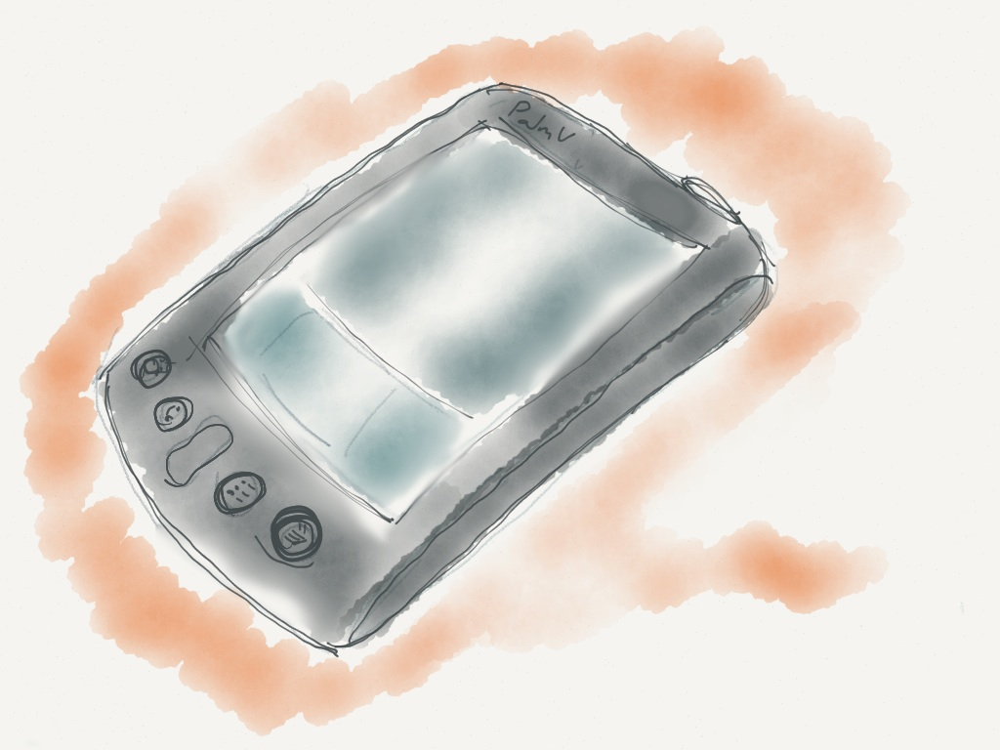


What happens when things are capable of navigating their lifespans? I wonder what those things would be like.
Would they be buildings that pay their own property taxes with their energy savings?
Or smartphones that knew where their recycling plant lived, and guessed at when they would arrive there? What if that recycling plant knew when to expect them?

## Decay

In the biological world, Decay is a physical phenomenon where materials become a simpler form of material and energy.

But in the culture of making objects, _decay is a multidimensional problem_. The physical decay of an object fails to sync up to the behavioural, cultural, or digital decay of that thing.

Decay becomes the natural output of an ecosystem of use, disuse, and obsolescence not dictated by material, but by software and consumer expectation from software behaviour. This decay is taking the form of obsolescence and apathy: a world of forgotten things with short lifespans and nowhere to go afterwards.

The danger is that culture rot is claiming the utility of objects before material rot ever does, and the physical casings that held the once functional circuits and software can take an eternity to decay.

To combat this, decay must be reframed as inherent to the value of an object. This can be done by situating time as something that adds value (or detracts by its absence), and by challenging the emerging anonymity and replaceability of network connected objects.

We want to enable a graceful ecosystem of creation, decay, and rebirth in a software-infested and thing-saturated world.

## Viridian Inspiration

I suspect that designing for decay means designing Viridian things.

In 1998, Bruce Sterling set out on a decade long journey called the [Viridian Design Movement](https://web.archive.org/web/20190612065150/http://www.viridiandesign.org/) . One of its many goals was to address the failures in the communication design of existing environmentalist movements, and to develop an interface for designers to become not green, but Viridian (i.e. effective).

His 2005 book, [Shaping Things](https://web.archive.org/web/20190612065150/http://www.amazon.com/Shaping-Things-Mediaworks-Pamphlets-Sterling/dp/0262693267) , synthesized much of the Viridian movement into a manifesto reminiscent of Machiavelli’s [The Prince](https://web.archive.org/web/20190612065150/http://www.constitution.org/mac/prince00.htm) . Razor focused in its intentions, accessible, and action oriented; Shaping Things gives its (possibly unwitting) readers a toolkit for parsing the past and present through Viridian goggles. For designers in particular, this means changing the way we make decisions for our world.

Viridian things are shaped by [many principles](https://web.archive.org/web/20190612065150/http://www.viridiandesign.org/principles.html) , and I’ve come to focus on two in particular:

**“Avoid the Timeless, Embrace Decay”** and **“Planned Evanescence”**.

A third principle, **“Be When You Are”**, serves to ground this exploration. I’ll explore decay through the lens of computationally-enabled things and contemporary technology: a subset of “Gizmo” culture that Sterling references in Shaping Things.

I’m looking forward to this journey with you.
