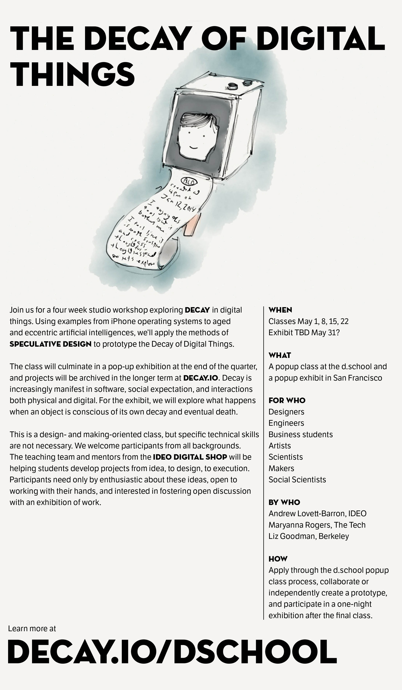

First, I will be giving a short talk [this Monday at the GAFFTA Creative Code meetup](https://web.archive.org/web/20190612065150/http://grayarea.org/event/creative-code-meetup-x-w-johan-lindegaard-jasper-speicher-more-tba/) on the Decay of Digital Things. I’m hoping to have things turn into a conversation around the project and where it can go!

Second, we’re excited to announce that the Decay of Digital Things will be a popup class this May at the Stanford D.School. Updates will be posted at [Decay.io/dschool](https://web.archive.org/web/20190612065150/https://andrewlb.com/dschool) .

In collaboration with [Maryanna Rogers](https://web.archive.org/web/20190612065150/http://www.maryannarogers.com/) and [Elizebeth Goodman](https://web.archive.org/web/20190612065150/http://www.confectious.net/) , we’ll explore the Decay of Digital Things with Stanford students in a studio workshop format, culminating in a one-night show of the results in San Francisco.
