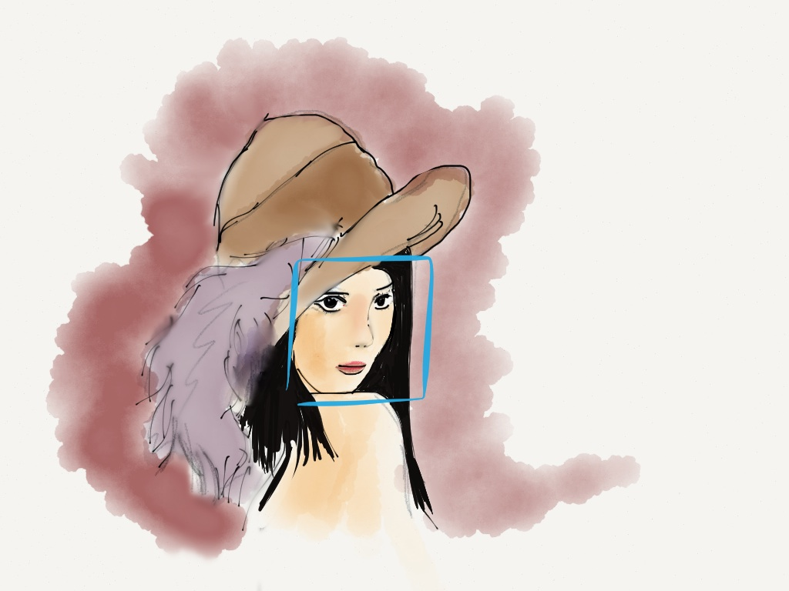

The world keeps tabs on us. The [recent revelations about the NSA and other organizations](https://web.archive.org/web/20190612065150/https://www.youtube.com/watch?v=b0w36GAyZIA) reinforced the impressive scale of this tracking, and show the contrast between modern techniques and those of the past. The expiration date on a driver’s license is a tool for biometrics. Registering to vote is a mechanism for observation. But now, we are so much better at it.

I want to explore whether these systems can rot from within. One of the most lauded qualities of software is its ability to be “upgraded”, often without physical change. New software is written, drivers are updated, techniques are refined, etc. But the reality is one of legacy systems holding a controlling interest on our interactions: old infrastructure running outdated software designed for calcified human systems.

What happens when our new software – with massive databases and sophisticated learning models – are left for ten, twenty, thirty years or more? Core to the human experience is that we grow and learn while having only limited foresight into our future state. What if we asked the same of computational systems?

A human baby learns to recognize faces early, and there is some debate as to whether facial recognition is hard-wired into the human brain, or [something that’s entirely learned](https://web.archive.org/web/20190612065150/http://www.psy.vanderbilt.edu/faculty/gauthier/FoG/Greebles) . In either case, our ability to recognize faces means understanding key physical form (that a nose goes here and not there), understanding how these forms are abstracted across categories (this is a human nose and [not a Llama nose](https://web.archive.org/web/20190612065150/https://www.youtube.com/watch?v=4J_FFvh_0aQ) ), and tying meaning to specific members of that category based on unique traits (your nose is different from my mother’s nose, so you can’t be my mother). These abilities make us highly specialized systems for understanding and reacting to the state of other human beings, and form some of the underlying mechanisms for navigating community, others’ emotions, and relationships.

Computers are not as good at this. A specially-configured computer might recognize a human face in an image, or a differently configured one might recognize – or even learn to recognize – a number of specific faces, but neither approaches the kind of adaptable specialization that humans demonstrate.

Implicit in the language of **configuration** is a kind of permanence that **learning** navigates around. The human condition is one of constant, often monumental, change that manifests itself in countless external and internal ways. A computer might be configured to [interpret the world like a professional forensics artists](https://web.archive.org/web/20190612065150/http://people.uncw.edu/ricanekk/teaching/spring09/csc100/lectures/pattersone/ComparisonOfSyntheticFaceAging.pdf) , for example, and project how [features](<https://web.archive.org/web/20190612065150/http://en.wikipedia.org/wiki/Feature_(Computer_vision)>) might change over time, but it would be ill-suited to speculating on the details of that change, and likely not even considered for that task. I wonder if we can truly build computers that can grow along with us, even if we configure them with those core capabilities.

## Paranoid Computers in a Haunted World0

I suspect that “learning” can be a kind of decay within a system. Learning might manifest itself through unexpected behaviour that drifts from a configured state, as if by [dead reckoning](https://web.archive.org/web/20190612065150/http://en.wikipedia.org/wiki/Dead_reckoning) . Just as an analog synthesizer needs to be adjusted like the instrument that it is, maybe the learning machine can drift out of tune through its own functionality.

Let’s imagine a system that could learn to interact on a pseudo-emotional level, had a database for remembering people, and could improve its interactions by “learning” from each encounter with a user. This system tries to identify visually, interprets an emotional response, self-corrects, and tries again. Like a person, it learns by re-configuring based on experience.

Let’s say it’s a concierge system for a condo parking lot.

But what if it was mostly unable to recognize faces like it was designed to: its lens is distorted, or maybe its image processor is poorly coded. Maybe’s it’s simply old. This distortion causes that computer to collect false, or semi-formed experiences. A series of cameras in a parking lot – now a normal thing – algorithmically squint at detected movement, trying to make sense of the known and the unknown. The sun sets, its lens flares, and suddenly everyone looks like that one visitor two weeks ago who was allowed in that time, right?

How would that computer – confused and confronted by aggressive users reacting to false negatives – reconfigure itself, and react to its inability to make sense of the world it was configured for, but can’t quite see. By trying to absorb a context based on a skewed understanding of the world, the computer is experiencing a kind of decay. It slowly drifts away from its original configuration and inadvertently finds itself in a state of obsolescence.

I find myself feeling a weird empathy for these kinds of machines. It’s an empathy for a simple thing caught unawares, almost like [Charlie Stross’ semi-sentient Lobsters](https://web.archive.org/web/20190612065150/http://www.technovelgy.com/ct/content.asp?Bnum=987) serving as confused artificial intelligence models for the human-centered internet. There is no easy solution for legacy software and systems. So how do we deal with them?

Maybe we exist with old systems the way that we will (hopefully) exist with our aging human population: with respect and inclusivity. An aged facial recognition system might be bolstered by proximity, the [new media pose](https://web.archive.org/web/20190612065150/http://www.kinecteducation.com/blog/wp-content/uploads/2011/05/Screen-shot-2011-05-19-at-5.21.32-PM.png) , or a patient pause of ones facial expression. Or perhaps its [understanding that some names need to be spelled phonetically or pronounced as such.](https://web.archive.org/web/20190612065150/https://vimeo.com/48204264)

Bruce Sterling suggested our future is one of [“old people in big cities who are afraid of the sky.”](https://web.archive.org/web/20190612065150/http://www.well.com/conf/inkwell.vue/topics/430/Bruce-Sterling-and-Jon-Lebkowsky-page01.html) I think this prediction might be applied to old cities with too many people that struggle for purpose, as well. As we continue to grapple with the challenges of legacy systems and their moldering infrastrcuture, perhaps we ought to also develop a practice of patient interaction design to deal with this future gracefully on both fronts.
