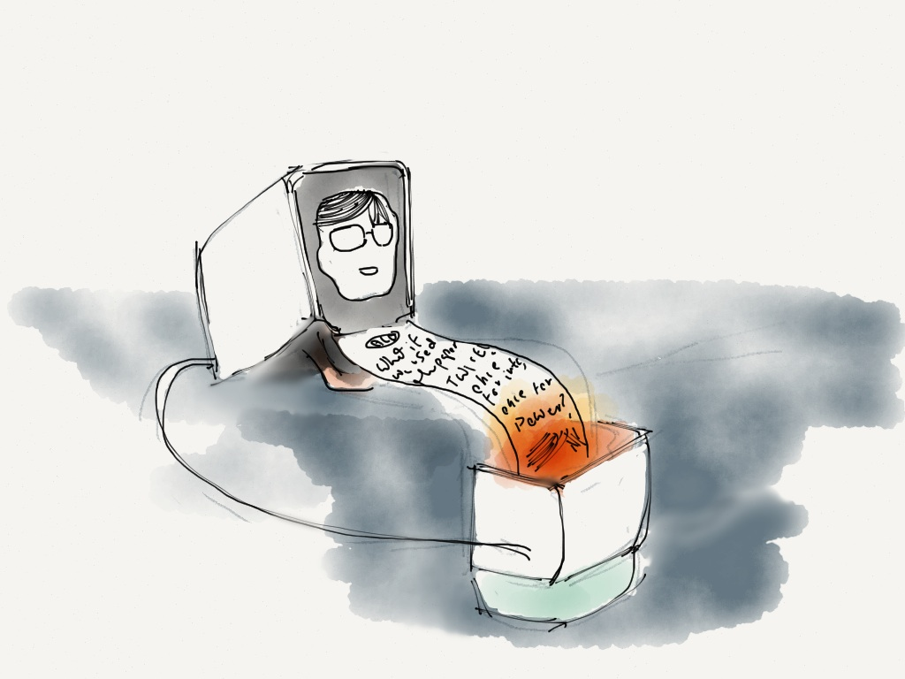



Decay of Digital Things was a series of essays and a course at the Stanford d.school. The goal was the ask what happens to digital things when they get old — hardware, software, and networks. It was a fun and temporal project that had a big impact on my later thinking. It's also something that others have asked me to re-upload, so I'm including what I could find here.

A longer writeup about Decay was published in the 2018 book, [The Internet of Other People's Things](http://kairus.org/portfolio/book-the-internet-of-other-peoples-things/)

[Designing for Decay](intro)

[Printing Things](printing)

[Sensor Ghosts](sensorghosts)

[Haunted Machines](haunted)

[Decay Talk at Gaffta](talk)

[Bacterial Computing](bacterial)

[Decay of Digital Things visits the d.school](dschool)

