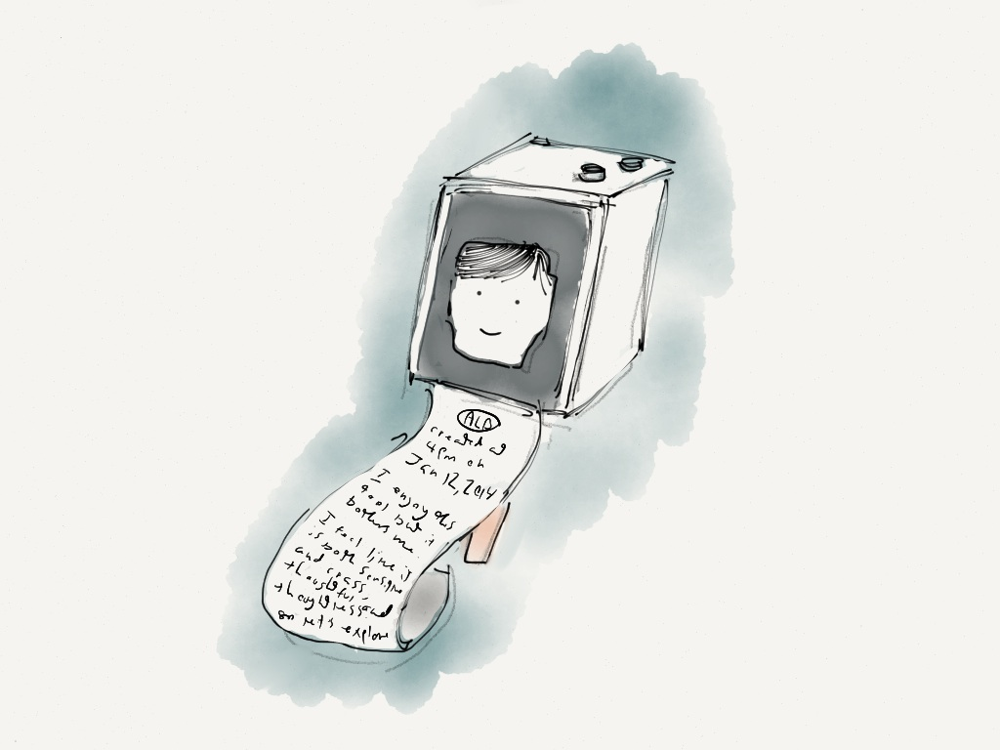



I make things. A restlessness sets in when I’m not using my body to manipulate some tool – be it a computer, a kitchen knife, or my bicycle. And I’m far from alone in this compulsion. What I hadn’t expected was to share this compulsion with machines.

Machines like the [BERG Little Printer](https://web.archive.org/web/20190612065150/http://bergcloud.com/littleprinter/) and the [Makerbot](https://web.archive.org/web/20190612065150/http://www.makerbot.com/) genus share this compulsion, and project their compulsion on us. More than any other type of tool, they evoke a style of creation that is specific to their nature, instead of complementary to ours. This makes it easy to get started within the frame they create. Whether by API or CAD, these tools are made to make, and we become their managers.

## Constructor

The Little Printer is a powerful case study in managed creation, or “instancing.”

The Little Printer emerged from [the theory of a Social Printer as articulated by Matt Webb](https://web.archive.org/web/20190612065150/http://berglondon.com/blog/2006/10/06/my-printer-my-social-letterbox/) , suggesting that the printer itself isn’t what’s valuable, but rather the appearance of an artefact tied to my tribe. The mail suddenly becomes mediated by the mailbox, and the mailbox’s role is to describe and manage the mail. The mail becomes an instance of the mailbox.

You subscribe to a variety of feeds via Berg’s web app, and from that point on, your Little Printer will print out the contents of that feed according to when you’ve scheduled it. The printer uses Thermal Paper, which has information printed on its specially-treated surface by a heated printer head. Berg points out that they use recycled and [BPA free](https://web.archive.org/web/20190612065150/http://en.wikipedia.org/wiki/Bisphenol_A) thermal paper, and [they’ve made clear efforts to be environmentally conscious](https://web.archive.org/web/20190612065150/http://bergcloud.com/help/#printing-and-paper) .

## ~Destructor

The question is what happens after the printing. There is no _method_ to remove this instance from the world. The Little Printer is a thing that creates without giving an option to destroy the creation when its usefullness is over.

What I want is a Little Printer with a [Destructor Function](<https://web.archive.org/web/20190612065150/http://en.wikipedia.org/wiki/Destructor_(computer_programming)>) . I want the Little Printer to take responsibility for its waste – not burden me with it. Just as well-written software cleans up after itself by freeing the memory it was using on my computer, I want the well-designed Making Machine to clean up after its mess.

So let’s start with the quintessential “Bad Idea.” I present to you, _Little Printer: self powered edition_.

