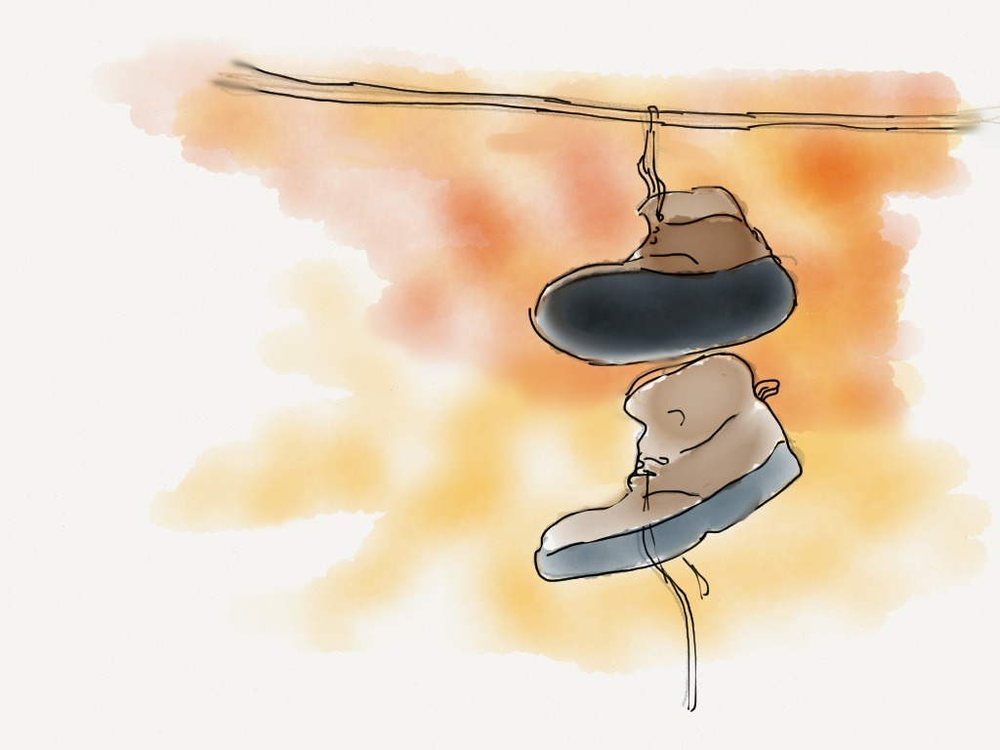

In high school, a friend once told me that a pair of sneakers hanging from a power line marked a place where drugs were sold. I later found out that this (mostly) wasn’t the case, but I still notice them dangling in the wind, as though they had meaning.

Lately, our shoes have become a vector for reading our behaviours. Tools like Nike+ currently exist as small sensor pods that attach to our shoes and talk to our phones, but in proposals and patent drawings, a future is being sketched that describes washable computers and fabric-like sensors, seeing these once detachable objects embedded directly into our clothing. And like any other fashion, if it wears out in style or in structure, it is discarded.

The MIT Senseable City Lab explored the strange life of the discarded with their project [Trash|Track](https://web.archive.org/web/20190612065150/http://senseable.mit.edu/trashtrack/) . For this project, the lab designed a circuit called [Trash Tag](https://web.archive.org/web/20190612065150/http://senseable.mit.edu/trashtrack/how-it-works.php?id=3) to be embedded in the refuse – including an old shoe – which worked by responding to movement and broadcasting a cellular signal to local towers. This signal was triangulated by the service providers, and sent back to the lab for analysis.

I’m wondering what the “fully embedded” future might look like, versus one that needs to be attached. If the seams of a piece of clothing can be [designed as an antenna](https://web.archive.org/web/20190612065150/http://researchnews.osu.edu/archive/antclothpix.htm) , then anything from a shirt or a shoe can be made to record and report. Presumably this will be in no way nefarious: these sensor-clothes will analyze our posture, or track how many calories we’ve burned today. They’ll measure heart rates, buzz when they detect an open Wifi system, or change shape depending on the temperature.

The electronics sewn into our clothes will be cheap, might be powered by Microelectromechanical systems (MEMS) or inductive laundry baskets, and will be utterly discardable like our clothing is now.

## Recycle lost sensor networks

So what happens after a wearable is discarded?

In my neighbourhood, there are a fair number of forgotten shoes jostling each other from their wirey perch. Since starting to think about this project, I’ve been wondering if they could talk to each other, or teach us something from their vantage point, were they suitably enabled with software and sensors.

What if the networked waste we’re creating continues to broadcast into the ether? What if their MEMS-enabled batteries and ultra low powered processors doing what they were designed to do: reporting on location, or movement, or localized heat, or brightness. They might send that data to a networked server, or ping helplessly for a phone or router they think is nearby.

I want to think about recycling digital things as not just reusing their components, but by recycling or upcycling their purpose. I’m wondering if there’s some way to turn the detritus of our vogues and narcism into a localized story. Maybe we could create a beacon for these discarded smart things: giving dead wearables a new life through access, organization, and transparency. A cheap computer, some clever routing, and a community catalogue of wireless protocols and APIs might be all we need to turn once private products into a localized and public sensor network. Like a digital version of Jane Jacob’s eyes on the street, these discarded smart things just might teach us something incredible.

