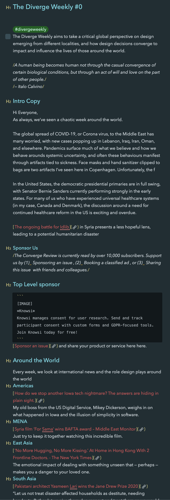
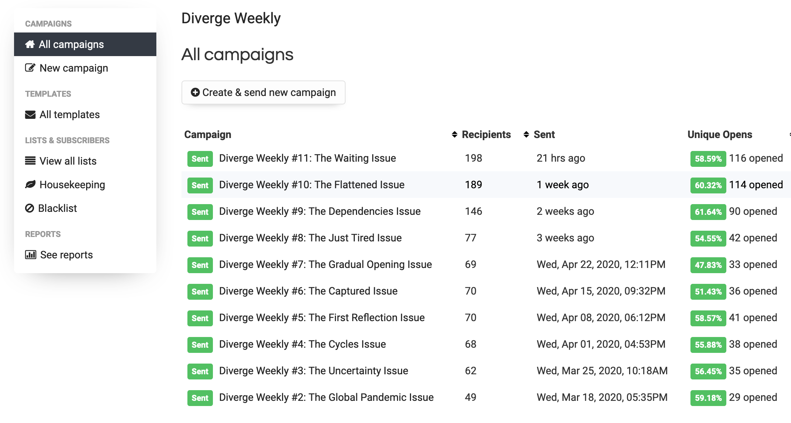
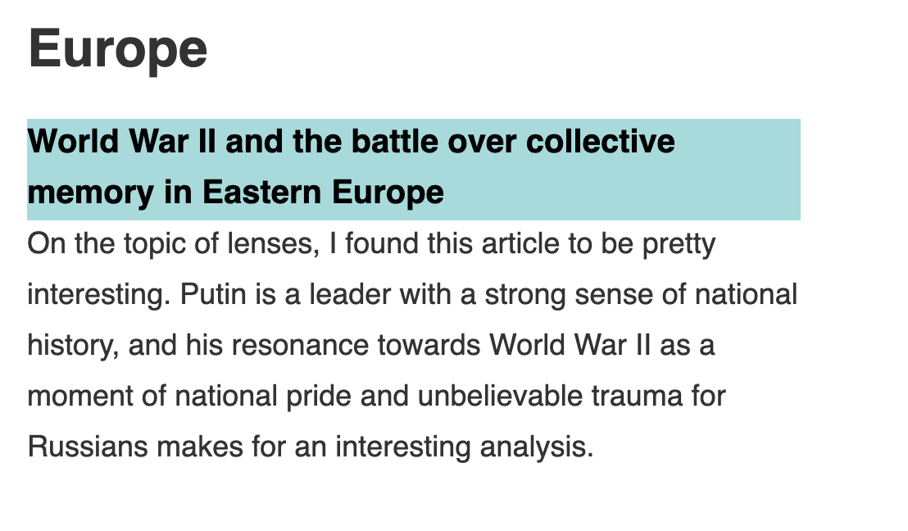
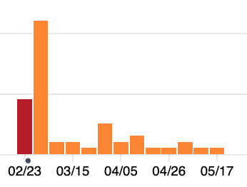

I wanted to share a bit about how I made [Diverge Weekly](https://divergeweekly.com), which has been an absolute joy to create and just hit 200 subscribers (you should join, by the way).

Shortly before the world descended into a pandemic, I had an idea for something I wanted to write. Last year, my friends Zahra, Marc, and I had been batting around the idea for a podcast (as one does) about design, strategy, and politics from a Canadian lens, but we were never able to coordinate between ourselves to get it together.

For the past few months, I’d been taking out some advertising with a newsletter called [Dense Discovery](https://densediscovery.com), which had been started by designer and editor Kai Brach. It was thoughtfully arranged, had a good pace, was opinionated, and helped me discover some things that didn’t normally have time to deal with. So using that structure as a template, I wrote my first newsletter as a prototype — a simple structure in markdown.


I love Markdown. It has its faults, but I find it faster and more intuitive than any word processor. I’m writing this in markdown using Bear right now, and will be uploading it as a markdown file to be compiled by Gatsby, after all.

And I took the same approach with Diverge. Early in the year on [andrewlb.com](https://andrewlb.com), I had upgrade my site from a simple Jekyll site to a gatsbyjs page, following their general tutorial for creating a blog and throwing in some modifications in the process. The workflow made a lot of sense to me, especially the part about Gatsby generating a static site and hosting it on GitHub pages. And since newsletters are just HTML, I figured the same workflow might apply there. It shouldn’t take a whole lot to take the same principle and apply it to a newsletter, right?

## DIYing a Newsletter Platform

Turns out it was more complicated than I thought. To begin with, I was starting with an advantage. As part of the privacy-first principle with [Knowsi](https://knowsi.com) (and a desire to reduce dependencies on 3rd party services, I self-host a newsletter system called [Sendy](https://sendy.co). Sendy is a PHP application that lets you manage newsletters. It does it pretty simply, though it certainly isn’t as full featured as something like Mailchimp. It has all the annoying bits of running your own infrastructure (eg. Keeping it updated), but I’ve enjoyed this approach.


So I had that part in place. But what about actually making the newsletter.

Well, upon deeper inspection, turns out newsletter HTML in a “cross-browser” sense is even more of a nightmare than getting browser-based compliance. I did some digging around, and again found Kai’s [look behind Dense Discovery](https://medium.com/@kaibrach/creating-a-fully-customised-weekly-newsletter-b7c31d580b4e) to be helpful here in deciding on what path to take. But I ended up taking the slightly harder one.

I started by forking andrewlb.com, and starting from that as a baseline. I was familiar with the codebase, so it let me get started pretty quickly.

I knew that I wanted a few things:

1. Everything must be component based
2. Everything should be responsive
3. I should write the newsletter only once

So, overall a few decisions were easy to make.

Since it’s Gatsby, using react components for layout was an obvious choice. That addressed the component based structure.

Because I was writing in Markdown, I could leverage Remark and the static rendering of that markdown onto the page. This also meant I could explore different Remark and Gatsby plugins to facilitate rendering.

Because I was using Gatsby, I figured I could override part of its rendering lifecycle and simply compile the same “page” is a few different ways.

And finally on the responsive front, I thought this would be easy, but as Kai’s article pointed out, turns out email HTML is a bit harder than I initially realized.

So let’s take each of these in turn.

## Make it Component Based

I’ve been using React for a while now, so know it pretty well. The JSX and component based structure, as well as the r eact component lifecycle in a server-side rendering context is pretty familiar.

I am also a _huge_ fan of styled components, though readily acknowledge the arguments against them. So a lot of decisions were less decisions and more defaults.

When it came to structuring the components though, it was a bit less clear. I initially thought I’d use MJML, for example. ’ve used MJML before to write the Knowsi newsletter, and have a template that kind of works for that. I had an idea that perhaps I could lay out react components using MJML syntax. But it turned out to be a bit more complicated than it was really worth. The MJML syntax described on the component level ended up being a bit of nightmare when it came to rendering the page out, and so I pretty quickly abandoned that approach in favor of simply laying out components using HTML tables.

There were also numerous components that I had to over-ride in the Gatsby process, including the `html.js` one. Normally this is managed pretty simply, but html emails require a handful of headers that help with renderin. [This was a helpful reference](https://webdesign.tutsplus.com/articles/build-an-html-email-template-from-scratch--webdesign-12770).

Finally, I had to figure out how to get the components to render the markdown appropriately.

This came from me kind of misunderstanding how Remark worked, to be perfectly honest. That misunderstanding resolved itself pretty quickly after I dug into it though.

I initially ended up using a plugin called `gatsby-remark-custom-blocks`, which took blocks of text like this:

```markdown
[[region | Europe]]
|[World War II and the battle over collective memory in Eastern Europe](https://www.dw.com/en/world-war-ii-and-the-battle-over-collective-memory-in-eastern-europe/a-53356626)
|On the topic of lenses, I found this article to be pretty interesting. Putin is a leader with a strong sense of national history, and his resonance towards World War II as a moment of national pride and unbelievable trauma for Russians makes for an interesting analysis.
```

And wrapped those in a stylable div. I still use them in the region section, to look like this:



This wasn’t really helpful for most of the things I wanted to lay out though, and it didn’t let my apply react component-level styling to those elements. Really, I was hoping to pass the markdown content into those components as props, and have it render appropriately.

The solution ended up being to use a tool called [Rehype](https://github.com/rehypejs/rehype). I simply wrote the different components with their appropriate props, and added this code to the post structure.

```javascript
import rehypeReact from "rehype-react"

const renderAst = new rehypeReact({
  createElement: React.createElement,
  components: {
    // These are some of the components I'm using
    region: Region,
    sponsor: FeatureAd,
    security: Security,
    voices: Voices,
    reading: Reading,
    main: Main,
    twitter: Twitter,
    imageblock: ImageBlock,
    classified: Classified,
    jobs: Jobs,
  },
}).Compiler
```

Then, where the markdown data is transformed by Remark, I added

```
{renderAst(post.htmlAst)}
```

And made sure that the graphql interface was returning the appropriate field:

```javascript
markdownRemark(fields: { slug: { eq: $slug } }) {
      id
      excerpt(pruneLength: 160)
      htmlAst
      fields {
        slug
      ...
      }
	...
}
```

This allowed me to structure the layout of the site as react components and simply pass in key values as props. [An example from issue #10](https://divergeweekly.com/issue/10/) is the component housing the main block.

```markdown
<main
  credit="Kunrong Chen, Daily exercise, 2014"
  quote="It occurred to me that no matter where I lived, geography could not save me. —  Isabel Wilkerson, The Warmth of Other Suns "
>
   Hi. First, I want to
  share a point of gratitude. My small business, [Knowsi](https://knowsi.com),
  was awarded the [Sage Ocean Concept
  Grant](https://ocean.sagepub.com/blog/tools-and-tech/concept-grant-winner-knowsi-interview)
  this week by Sage Publishing. ... As always, [please subscribe to and share
  Diverge Weekly](https://divergeweekly.com) if you haven’t and [send me a
  note](mailto:alb@andrewlb.com) if you have questions or feedback!
</main>
```

This has some weird bits, but it’s working pretty well so far provided I want to stick with markdown.

In terms of general workflow then, I usually write the main article in Bear, export to markdown into the Gatsby content folder, and do a quick copy-paste to this template I’ve created:

```markdown
---
title: The First Reflection Issue
issue: 5
date: "2020-04-08T09:00:00.000Z"
description: "This is issue #5, so I figured it was time for a short reflection"
category: issue
published: false
image: img/__________.png
tags:
  - newsletter
  - "2020"
  - reflection
---

<main credit="" quote="">
   Hi. As always, [please subscribe to and share Diverge
  Weekly](https://divergeweekly.com) if you haven’t and [send me a
  note](mailto:alb@andrewlb.com) if you have questions or feedback!
</main>

<voices who=" " role=" " image="img/ ">
   fdsdfsdf [ ]()
</voices>

<twitter who="">
  [ ]()
</twitter>

<region>
  [[region | East Asia]] |[]() | [[region | South Asia]] |[]() | [[region |
  Americas]] |[]() | [[region | MENA]] |[]() | [[region | Africa]] |[]() |
  [[region | Europe]] |[]() |
</region>

<reading title=" " author=" ">
   fdsdfsdf [ ]()
</reading>

<security credit="">
   []() sdfsdf
</security>

<jobs>
  [[jobad | ]] |[]() |Located in | | [[jobad | ]] |[]() |Located in | |
</jobs>

<sponsor image="https://www.knowsi.com/static/tier1.png">
  ## Knowsi Knowsi manages consent for user research. Send and track participant
  consent with custom forms and GDPR-focused tools. [Join Knowsi today for
  free!](https://knowsi.com)
</sponsor>

<image credit=" " link=" ">
   sdfsdf
</image>
```

Then simply double check that things look right on development, turn `published` to true, and deploy to `gh-pages`.

## Everything Should Be Responsive

This turned into a massive pain.

The initial site came together in about 3 days of pretty frantic work in February.


And it didn’t really look that great. I was borrowing the initial layout from [Dense Discovery](https://www.densediscovery.com/), and hadn’t really figured out the Rehype part yet. So I was trying to lay things out primarily with CSS, and mostly just get something up to see if it worked. I default (to a fault) towards spin up prototypes, put in front of people, see what happens.

There’s not much I can say here that hasn’t already been written by more knowledgeable folk. I would suggest checking this out as a starting point for html emails:

[An Introduction To Building And Sending HTML Email For Web Developers — Smashing Magazine](https://www.smashingmagazine.com/2017/01/introduction-building-sending-html-email-for-web-developers/)

And for the blog itself, make sure to test that SEO and open graph data is being hydrated properly:

[Social Share Preview – Check social media link previews](https://socialsharepreview.com/)

I’d actually messed something up in the way that remark was rendering things, and as a consequence the first month of the newsletter didn’t render properly. After I changed that, I started getting a lot more clicks and folk contacting me about my writing.

## Write it Once

Finally, I just wanted to write this once, so that the Gatsby page itself should render at the same time as the mail page, and everything should be easy.

I tried a bunchhhh of different things, and ultimately resolved on just taking the rendered HTML as it was, and transforming THAT into the mail html. The ideal would be that I’d render two different, properly formatted versions, but I couldn’t quite figure out where to do those modifications, so this became the easy point of intervention.

Here’s the code:

```javascript

exports.onPostBuild = async () => {
  console.log(
    “Build Complete for Post Build”,
    path.resolve(__dirname, “public/mail/“)
  )

  const pattern = “public/mail_*/**/*.html”
  const files = await globAsync(pattern, { nodir: true })

  const inlined = files.map(async file => {
    const data = await readFileAsync(file, “utf8”)
```

First, I grab all the files in the mail folder which were rendered with CreatePage, and loop through them.

```javascript

    return new Promise(async (resolve, reject) => {
      let html = String(data)
      const url = “https://divergeweekly.com”

      const $ = cheerio.load(html)

      $(“script”).remove() // remove scripts
      $(“noscript”).remove() // remove scripts
      $(“link”).remove() // remove links

```

Then I remove the tags that aren’t going to be used. Links, script, and noscript. I never use jquery anymore, but for whatever reason it was a helpful default here, so I ended up relying on Cheerio just for simplicity sake.

```javascript


      $(“img[src^=‘/‘]”).prop(“href”, function(_idx, oldHref) {
        if (!oldHref) {
          console.log(“Something is weird”, oldHref, _idx)
        } else {
          return oldHref.append(url)
        }
      })

      // Convert Gatsby image to image
      $(“.gatsby-resp-image-wrapper”).each(function() {
        const _this = this

        $(this).replaceWith(
          ``
        )
      })

      // Convert picture
      $(“picture”).each(function() {
        const _this = this

        $(this).replaceWith(
          ``
        )
      })

```

I think went through and converted all the images to absolute links and removed the Gatsby responsive images. I wasn’t able to figure out how NOT to use Gatsby images while still leveraging the Sharp plugin for optimizing the image rendering, so this became my shortcut. It’s not the cleanest, but it works pretty well.

```javascript


      // Convert all links
      $(“a”)
        .not(‘[href^=“http”],[href^=“https”],[href^=“mailto:”],[href^=“#"]')’.each(function() {
          $(this).attr("href",”function(index, value) {
            if (value) {
              if (value.substr(0, 1) !== "/“)“{
                value = url + value
              }

              return url + value
            } else {
              console.log(“Weird.”,”index, value)
            }
          })
        })
```

I think convert all the links to absolute instead of relative values.

```javascript
const text = htmlToText.fromString($.html(), {
  wordwrap: 130,
})

const inlined = juice($.html())
```

Then I render a compile the rendered html into a text format as well for raw-text newsletter rendering, as well as inlining all of the css.

```javascript
      // Write HTML
      fs.writeFile(file, inlined, err => {
        if (err) {
          reject()
          console.error(`Inline CSS error on write file:\n\n${err}`)
        }
        resolve()
      })

      // Write Text
      fs.writeFile(file.split(".")[0] + ".txt", text, err => {
        if (err) {
          reject()
          console.error(`Inline CSS error on write file:\n\n${err}`)
        }
        resolve()
      })
    })
  })
  await Promise.all(inlined)
```

Finally, I write the converted and inlined file back to disc, and also add a text file to be used in the newsletter.

All and all, this isn’t the cleanest way to approach it, but it works pretty well.

Last but not least, I write everything to the mail server and create a new campaign using the [Sendy API](https://sendy.co/api).

I don’t actually have this implemented, but it would look something like this.

```javascript
  return fetch("url+"/api/campaigns/create.php", {
    method: "POST",
    mode: "no-cors",
    credentials: "same-origin",
    headers: {
      "Content-Type": "application/x-www-form-urlencoded",
    },
    body: new URLSearchParams({
		plaintext: text,
		html: inlined,
		title: title,
		from_name: config.from,
		from_email: config.email,
		reply_to: config.replyto,
      list: config.listid,
      boolean: true,
      subform: true,
    }),
  })
```

## Reflecting

So. Overall, this has been a fun way to learn the details of how Gatsby works, and certainly reflected my workflow. Also, development time aside, the bulk of the TIME spent on the newsletter is content focused, which is exactly what I wanted.

I love that the newsletters are their own discrete markdown product, stored as files and folder structures, and just clean.

However, there’s been a few weak points.

First, I want to create more of a database style approach to the voices, as my hope is to (over time) curate a list of incredible global designers who deserve a stronger voice. Those voices shouldn’t be confined only to that particular newsletter, so I need to figure out a way to address that part.

Second, the jobs have been a big point of value for folk, and having a more consistent job board for global design roles is something I’d like to emphasize. Likewise, that needs a CMS or board, not just a newsletter.

Third, the essays interconnect conceptually such that I’d like to explore different approaches to linking and referencing, even within a series. So far I’m just linking to things, but there might be a better way to approach that.

Finally, the production part of this newsletter is confined to my computer, and so I rely on copying things over to Gatsby and that 15 or so minutes of getting everything compiled and rendering properly.

So, all told, I actually think in the future I may re-write the Diverge site and workflow to support a headless CMS as my platform, as a relational database of some sort seems to be the next step. I’m likely to go with something like Strapi or Netlify’s CMS, but haven’t really decided yet.

In the interim though, I’ll be writing Diverge each week somewhere in my beloved markdown editor, trying to figure out how I get everything together before Wednesday.

Finally, one quick note. HUGE thank you to [Scott Young](https://twitter.com/scottalyoung) for helping me find my voice by reading and critiquing the early posts, [Kai Brach](https://www.brizk.com/) for inspiration and advice, [Ayla Newhouse](http://www.aylanewhousedesign.com/) for absolutely everything including holding onto the baby while I frantically try to finish the newsletter, [Hilary Predko](http://hillarypredko.com/) for feedback and sharing Diverge on her newsletter, [Janice Wong](http://www.runcomrade.ca/) for unsubscribing with some feedback that dramatically changed my writing style, and [Zahra Ebrahim](https://twitter.com/zahraeb) for the constant support!

Thanks for reading (and [subscribe to diverge](https://divergeweekly.com))!
