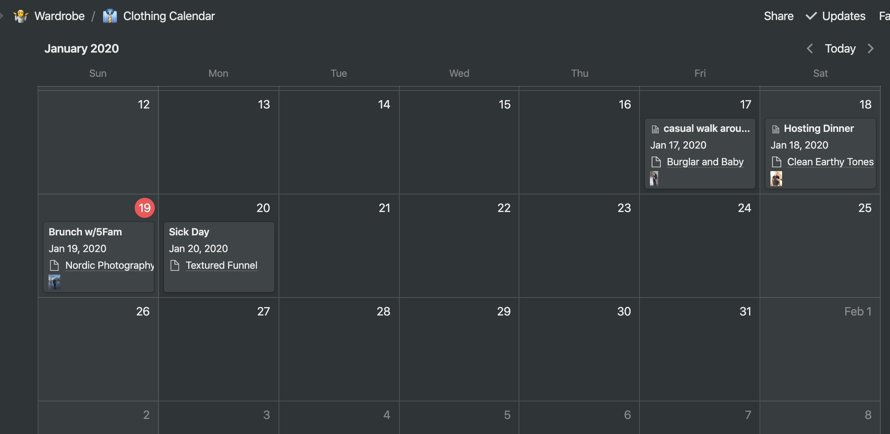

I have an affinity for jackets and bags. These two central functions to protect and to carry somehow stand out in my mind as being what this whole clothing endeavour is about. In the quest for a more perfect bag and a more perfect jacket, I’ve tried many form factors and many materials. However, somewhere along the line this search evolved into more of a collection and less of a solution.

I recently took stock of the jackets I had, and realized that some of them hadn’t been worn in some time. The same could be said for many of the other types of clothing. I have my daily wears (which were being worn out), but a lot of the clothing that had inspired me at the point of purchase or that I’d long contemplated wasn’t being worn and explored.

Further, despite my attempts at the Marie Kondo approach (which definitely works), I’d hit a point of diminishing return. I really like the clothes that I have. Though I suffer a bit from the [Blokewear](https://www.telegraph.co.uk/men/fashion-and-style/11432284/Blokewear-the-clothes-men-love-that-women-hate.html) thing. They either fit a style or an aspiration that I wanted, they were mostly of a quality that was worth preserving, and sometimes there was even an emotional connection or event tied to them. So another option was needed.

## A More Perfect Closet

The digital closet or mirror idea is a trope that I’ve seen quite a bit from the tangible interface/new media world, not to mention the genius that is [Clueless](https://youtu.be/XNDubWJU0aU). What if computers could help us look good with what we have (though software business models being what they are, we’d be sold a lot), and make the inferences and connections between different pieces of clothing for us. No need for colour coordinating, fit experiments, or quotidian creativity.

Elsewhere in my life, I’d been using different tools that “automated” aspects of personal fitness for years. Strava and TrainingPeaks both have scaling training plans that tie into your phone and your Garmin, effectually offloading the responsibility to plan and personalize. But I’ve come to believe this was creating an intellectual weakness in how I approached maintaining the body. When a training plan ended, or if I got knocked off it somehow by work, a cold, or travel, the return to that curated path felt unnatural. Despite the exhaustive metrics surrounding me, I didn’t know how I got there, so I didn’t know how (or why) to continue.

More recently, I’ve been using plans from the MT Institute, which just come as a weekly calendar of “Do this.” No tracking, and their app is basically just a text document with a password. It was infuriating at first. But because of that friction, it’s forced a planning and engagement with my fitness that I haven’t had in years. Somewhat naturally by extension, I started to learn the how and why of getting somewhere and keeping going.

This relates to the wardrobe because the fabric we wrap ourselves in serves to work a kind of daily muscle. In some ways, we are incredibly limited. We have a limited wardrobe, filtered through biases and the influence of media and the social scenes that we came to age in, to address a specific set of needs around environmental conditions (rain, temperature), cultural conditions (formality and clique), and personal conditions (mood, aspiration, functional exigencies).

But in other ways, it is incredibly liberating. It presents a daily opportunity for creativity, exploration, and novelty with the things that we already own, that are being created, or that others have left behind. With all the cultural weight that goes into forging a particular piece of clothing — anatomy, cultural context, history, material requirements, cost requirements, style, and similar — there’s the daily opportunity for something new to emerge.

Despite having that opportunity every day (and me more than many with my absurd jacket collection), why wasn’t I working that muscle? I felt there might be a hint in the three things that these text-based training plans were giving me: productive friction, a need for planning, and additive practice. So I’m doing an experiment.

## Getting Organized

I’ve thankfully had a fair bit of experience working across different tools to project management. Everything from spreadsheets to Basecamp to Trello to Podio were potential options. I’d been aware of Notion for a while (mostly via a constant stream of Medium posts about either going to Notion and never looking back, or leaving notion and looking back in sadness).

Anyway, while my understanding of what Notion could do was pretty loose, the core of it seemed to be just relational databases with a handful of configurable views. Without thinking about it too hard, I thought that was all I needed.

After all, think about how you structure a wardrobe. You have lots of different types of clothing, all of which fulfill usually one or two functions. They have different properties to them: some are warm, others are waterproof, some are both. Some are made of leather, others of synthetic fabrics, still others of cotton. Some are blue, others gray, others black (at least in my case). So one can broadly generalize “clothing” as something with properties that serves to shield some part of your body. Of course, there are other things. Shoes, accessories, bags, etc. We’ll get to that.

In general though, an outfit ends up being some combination of those pieces of clothing, plus some of the other things. That combination is most fundamentally constrained by the cultural and physical environment, and what you have available. Then you get the next level down: constraints emerging from ones own taste and context — where did you learn to dress yourself? And then you get additional constraints emerging from the combinations with contrast, clashing, and complementary mixes coming up.

Ultimately, no system that I put together in an afternoon is going to replace a sense of style and intuition, but what I wanted to accomplish a few things:

**Creative**

- To visualize or summarize how a set of things might look together without “going searching”
- To wear more of my clothes more consistently in combinations I hadn’t tried before
- To save the combinations I knew worked

**Practical**

- To be able to “schedule” what I was going to wear in advance (i.e. put things out for the next day as part of my other evening responsibilities)
- To track frequency of wears across the different pieces of clothes I have
- To track what I need to repair, tailor, or clean more effectively.

Understanding Notion as I did, I believed that it would look like when implemented:

1. Item (with properties)
2. Several Collections of Items (Aggregation of properties)
3. Schedule of Collections (Record of Use)

So I set out to do that.

## Using Notion

Using notion to realize the initial vision was simple. At its most basic, Notion’s data manifests as a table or text. I started by creating a list of as much as I could from memory, and then filling that into the spreadsheet. From there, I started to fill out the properties (i.e. columns) that made sense. Name, photo, tags, size, colour. Then more subjective things, like fit and potentially style: things that I could search by. I then went full Mari Kondo on my closet, getting everything out and photographing the lot against a white(ish) background.

This was the project of an afternoon, done during my son’s naps and an hour my wife was able to buy me. After I got everything in the database (all clothes, shoes, and bags anyway), I started to explore setting them up as separate views and creating the relational structure that would define the “outfit” idea.

The outfit is where things didn't quite work as I wanted. Structurally, it’s relatively simple, just a matter of creating relationships to the different Clothing items. This ends up looking something like this, with a few variables that help with filtering and a photo for reference.

Then, when browsing, I can view the individual outfits with a description and a focus on the jacket.

In this case, I would frame this part as the “Productive Friction” component. Before I was just collecting data and constraints, now this is combining these pieces into a greater whole that (hopefully) works out.

Though this solution is “good enough” for now, I can’t wait for Notion to develop an API to query these objects and relationships directly, or to programatically establish filters. Basically, my ideal would be to create a collection of items with tags, and then have those items laid out in a gallery so I could see them visually. As it stands, there’s still a bit too much friction.

The manual way to do this is to create a view for a table, and then filter according to relationships. Unfortunately, since those filters can’t be assigned to a variable, the whole thing has to be done manually (as far as I know). The ideal would be to pass in a series of properties to the view that could manipulate the filter, but here we are.

Finally, actually making a day-to-day decision is tied to seeing those combinations and those other external needs. In other words, the need for planning. Filtering by the relevant constraint is the key part here. From there, I can take a look at the options and what I need for the day, and make decisions on the margins.

Calendaring is usable but a bit inefficient. This is an example of the past few days to test out this whole idea. Unfortunately, Notion lacks integration with Google calendar, so the calendar view itself ends up being quite limited.

What was useful (again, an API would be better) was filtering calendars by day, and then adding the view inline as shown below. This allows a trivial dashboard to be created, though again, it’s not particularly useful without a way to dig into the relations.

Notion is a pretty impressive tool. It’s a great way to create content and build up something data-driven pretty quickly. Ultimately, it got me a lot further than I expected, but if the [Notion public API wasn’t already a critical part of their roadmap](https://www.notion.so/Does-Notion-have-an-API-I-can-use-4541b07a5caa46dba0026624646118c0), I would probably be trying to figure out how to export all this work and build a small custom solution.

End of the day, a custom solution would be better, but as a catch all for organization (eg. You can see in the screenshot that I’m also using Notion to plan and track these posts), I’m pretty happy.

## Getting to Outcomes

Technical details of how I’m approaching this aside, does it actually work?

I’m not sure yet. I’ve worn colours and individual pieces over the past few days which I haven’t touched in months. One pair of shoes had to be dusted off (though thankfully I’d taken good care of them previously). So only a few days in, I do feel like it’s having an impact.

My hope is to follow this pattern for a little while. This is where the additive practice part comes into play. A decade ago, I followed blogs like the [The Sartorialist](https://www.thesartorialist.com/) and [FaceHunter](http://www.facehunter.org/), but never understood quite how someone got from where I was to where some of the repeat subjects on those blogs found themselves. Now, I don’t feel that same need, but I do want to use what I have for the greatest utility and the greatest fun. In this case, it means the goal is to reduce my sense of decision fatigue and increase the variability and interest in what I wear. So I’ll practice. I’ll follow this post up in a few weeks or months with the outcomes.
