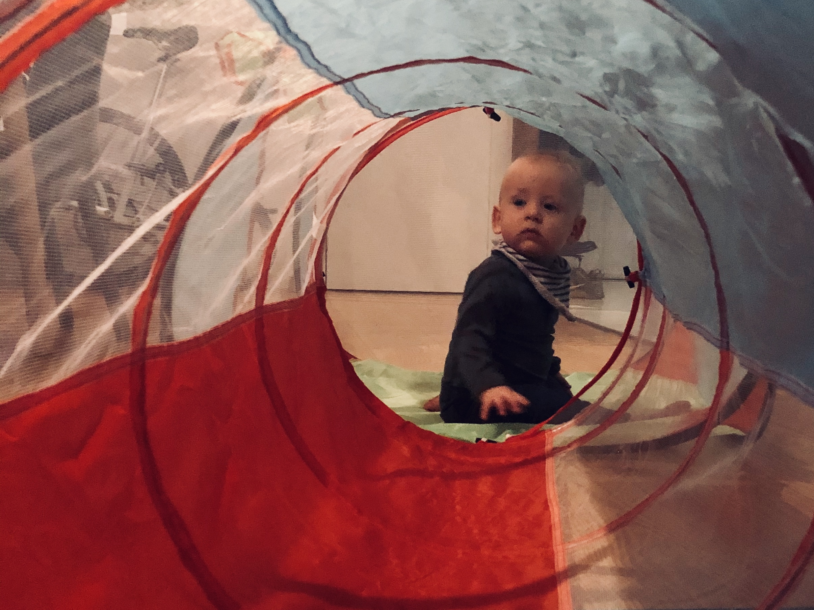
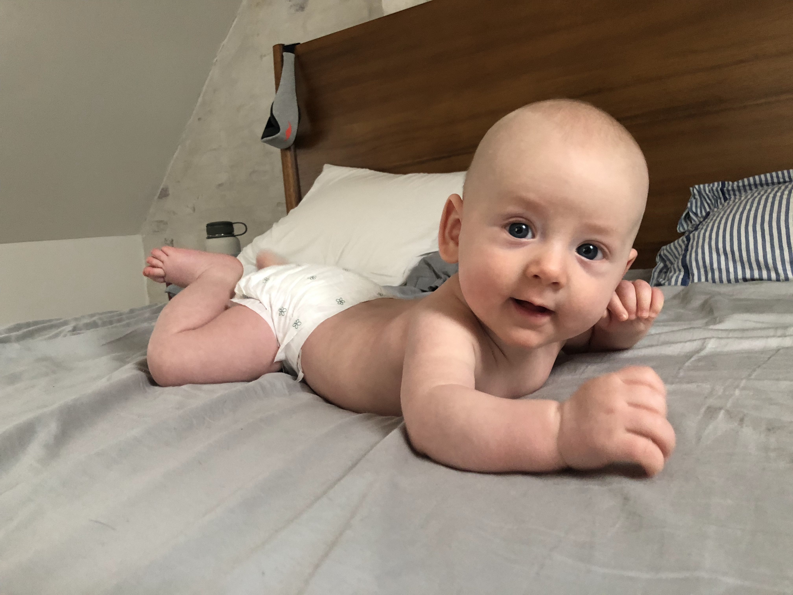
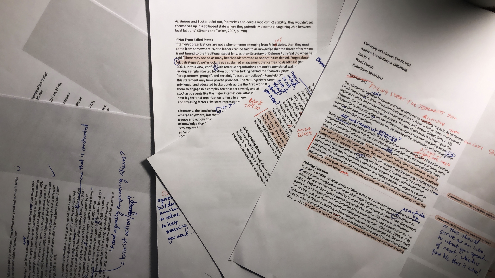
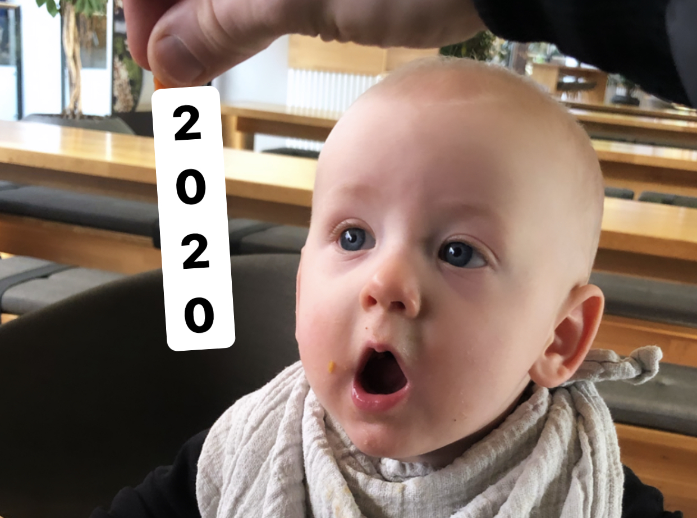

2019 has been a weird combination of my most exhausting, fulfilling, chaotic, and structured to date. Midway through 2018, I decided that I wouldn’t share anything until it was “done”, or at least passed a significant milestone. So anyway, I’ve not written these kinds of things up till now, but this year felt somehow significant.

## Four Changes

Four big life changes happened this year, mostly set up by the events of 2018.

First, and most importantly, my son Emil joined us. Writing this, he’s eight months and two weeks old. It's insane.

Second, I created [Knowsi](https://knowsi.com), a small SaaS business. You can sign up for a free account if you use consent forms in your work.

Third, I started a (part-time) graduate program in International Security Studies. This came from a lot of thought following my experience as a New America fellow and at the Pentagon.

Fourth, I survived the fall, where all three of these came together with my consulting practice. A lot of this was because the work load became a bit unfair in our household, and so we did something about it.

## The Baby – Emil

My wife Ayla had for a long time been afraid of the idea of child birth from a pain and discomfort perspective, and this is certainly understandable. But in 2018, while I was off in New Hampshire getting my wilderness EMT certification, she shared that she was pregnant. She then spent the latter half of 2018 trying to understand what that meant to her: her body, her identity, and her relationship to work, to the world, to me, and to the son we hadn’t yet met.

When Emil showed up on April 10th, 2019 at our home in Frederiksberg, Denmark, for all the classes and reading and discussions of the previous months, I wasn’t even close to prepared. Since he’s arrived, every week has been different, and every week has forced a new thing learned and adapted: with him, with Ayla, with our pets, with our friends, with our work.

With some planning and savings, I was able to take three plus months of paternity leave after he was born. In this whirlwind of diapers and family visits, I was able to learn a bit about how caring for Emil manifested as action: changing a diaper, giving him a bath, checking if he’s warm enough, making sure he’s fed (the first few times the confused look he gave me was incredible), rewatching the baby heimlich on YouTube for the 12th time. These little things have started to paint a picture of fatherhood for me that I enjoy and that I want to build upon — parenthood as a craft. Any craft requires practice and introspection and that’s been (more than anything else) the past eight and a half months.

## The Product – Knowsi

[Knowsi](https://knowsi.com) emerged from a few months of saving and ideation. Coming off of an extended consulting project that had seen me back-and-forth from the UK, I had been collecting and exploring different ideas for a small, bootstrappable Software-as-a-Service business. My theory: knowing that Emil was on his way, I wanted to have something that could bring in income and support a working lifestyle that would let me be around.

I settled on Knowsi while flying into Paris from Calgary after a visit with Ayla’s family. Consent management had always been a challenge in user research, with lost forms and disempowered participants. It was a discrete problem, something that I was solving for myself, and was feasible with my skillset as an indie product person.

I spent the next few months getting it off the ground, piloting it with the the Copenhagen Institute of Interaction Design, and rapidly turning it into a thing. When Emil was born, I took a few months off, and my diaper changing speed has been positively reviewed as “incredibly impressive” by such critics as my mother. Unfortunately, Knowsi didn’t progress much in that time.

This year, I learned that focusing on a product as a solo founder is hard. While I can do most of the product work and some of the business, my marketing skills are apparently useless. So in the new year, I intend to re-focus on Knowsi and ask for help and collaboration from friends, colleagues, or people who share a similar excitement for qualitative research and the value of privacy and respect towards research participants. I've also just launched free-tier accounts to support students and solo researchers in gathering and maintaining consent with their research participants.

## The Degree – Starting a Masters

I have been flirting with the idea of graduate school for years now. In 2012, I had been accepted to NYU’s ITP program and had been all set to move down to New York. However, after months of soul searching, I ended up not going because frankly didn’t want to be in that kind of debt.

Since then, I’ve had a lot of fun: starting two businesses, working at IDEO, working at the Pentagon, being a think tank fellow, and currently living a slightly charmed independent consulting/product person’s life here in Denmark. Also, as my wife will attest, every single year I start musing about returning to school.

In the summer of 2018, coming out of my fellowship with New America, I had started to explore working more deeply in issues surrounding the refugee crisis, climate change, and a more systemic view of security. After many conversations and explorations, I landed on Security Studies. Despite my career in code and design, my academic roots are in political science, so I had some familiarity with the topic. After puzzling over how to apply for this program, I ended up reaching out to my former professor, Renan Levine. I did not get particularly good grades in Professor Levine’s classes, but I reached out to him because he had a massive impact on my transition into design.

Specifically, he taught me how to externalize my thinking, how to approach it systematically, and how to use visual thinking as a lever for creativity. I would go on to apply what I learned in his research, policy, and statistics classes for years after leaving the University of Toronto, and have always been (heretofore silently) grateful for his help.

Despite nearly a decade between his classes and my application, he graciously wrote my recommendation letters that helped me get into a security studies MA in the UK.

Having just wrapped up the first term and starting to think about my dissertation, I have difficulty expressing how excited I am for the whole enterprise. It’s far from easy: I have to be incredibly structured in my time, I’m often up till two or three in the morning, and it has meant getting creative with the day-to-day of the household (which I’ll talk about next). But if you have the opportunity, I cannot encourage it enough.

## The Problems — Survival

Finally, survival. I’ve been unbelievably lucky this year. My wife and I have benefited from the Danish parental leave policies and I had access to personal capital to start a small business, I had access to a network and the time to apply for a university, and the network to be choosy in my work.

But the past year has been perhaps one of the busiest of my life. Keeping up with friends and social engagements has been a struggle. Beyond even the normal limits to sleep that new parents face, I’ve had to deal with a likely unhealthy number of nights of just four to six hours of sleep.

Dealing with multiple responsibilities: Emil, working with Knowsi customers, consulting as a product manager with IKEA, leading design mentorship with the Innofounder accelerator program, and finally, acclimating to my grad program. I managed to burn myself out in a few weeks and things weren’t working. With some reflection though, I was able to figure out some new techniques for time management and tracking everything. It still involved late nights, but nothing really slipped — or at least that’s what I initially thought.

In this initial “balance”, I unfairly relied on my wife to pick up types of slack that I was frankly unaware of. We’ve been working together to figure out how to balance that better, using our own skills as designers and managers to figure out “okay, what does it mean to be equal?” If you’ve got a background in service design and facilitation, turn those skills on yourself and your relationship. We’ve been trying out this (flawed but useful as a starting point) method articled in the [Fair Play](https://www.goodreads.com/en/book/show/44071899-fair-play) book, and augmenting it with various facilitation tools.

Ultimately, a willingness to share, visualize, and design the hard conversations by way of whiteboard, post-it, and artifact goes a long way. Especially given the speed at which Emil’s needs change, we have a standing meeting every week to also figure out how our needs are changing.

## What Didn’t Work

There are a few things this year that didn’t quite work out.

- As a consultant, I (purposefully) brought in a lot less revenue than I normally do. I’m fortunate to be able to even make the decision to work less and make less, but still, it was a dip from previous years and I felt a fair bit of emotional stress even with it being intentional.
- As a startup design mentor, I dropped the ball this autumn. Despite successful workshops facilitated and some great reviews from my teams, I wasn’t nearly as present or available as I had been previously.
- As a friend, I was never around. Part of this is a function of adult life for anyone, but I was conspicuously absent from group chats, even drinking, and general hangouts. Even when friends came to visit, I often had to truncate my time to work on an essay or deal with work. I haven’t figured out how to be better at this yet.
- As an indie devfounderwhatever, I got distracted a few times. For example, instead of focusing on Knowsi, I spent a few weeks building an MVP of a product called FitFaj. There are a few people using it, but I really should not have done this.
- I started studying Arabic in the Spring of 2019 after almost six months of trying to get into an Arabic language school in Copenhagen. I’d initially been studying Danish, and abandoned it when the state-supported language centres were defunded. I’ve also been studying pretty consistently with a tutor from [Natakallam](https://natakallam.com/). However, I honestly don’t feel like I’ve gotten that far, and having just finished my most recent textbook, I’m struggling to figure out what the next step is. Regardless, the language itself is immensely interesting, and being able to read the script and understand some basic sentences has been an interesting eye opener.

## Things that Did Work

- **Nutrition** was a bit of the bass rhythm for this year. I think I would have struggled without it. I started following a keto diet in 2018, and then keto-like with just low carbs (no one should be denied lentils and bananas).
- **Fitness** has been a bigger piece: I’ve been following a series of plans by the Mountain Tactical Institute folk, and have really enjoyed them. I also got certified as a personal trainer (I use certifications to learn about things like this, also because of the FitFaj diversion). I don’t really follow my own plans (though my wife asked me to design a few postpartum plans), but it has really helped make sense of the why and how of others. That knowledge has also motivated me to go with a consistency that frankly I’ve never been able to keep before, about 6x a week.
- Zeroing out my **email** inbox is a bit obnoxious, but it’s been a primary technique for keeping on top of what’s coming in. Combined with a solid todo list (I use Things, but anything works), it’s permitted an offloading and addressing of things in bitesized chunks, and opened up more space for actually doing work. It’s far from perfect, but it’s helped me immensely.
- Acknowledging **cycles**. This one is hard for me. Basically, I can work intensely and well in cycles, and then need to reset. Usually, this manifests as my sleep schedule being out of whack, or one of my core habits (like the inbox thing, or fitness) slipping. This year, I feel like I finally got a handle on these cycles in a way that made me a lot more effective.

## Going into 2020

So what does 2020 look like? Honestly, I don’t know yet, and to the point of my "don't share until there's a milestone" thing, I'll share when it's time.

In general, Emil is starting at daycare in the new year,so I'm going to modify my [Bullitt bike](http://shop.larryvsharry.com/) for daily dropoff and figure out my sleep schedule. I’m continuing to work on Knowsi, and want to explore ways to put more time into it and my customers. I'm continuing to consult with IKEA, and work with a burgeoning team there that honestly, I can't wait to share more about.

Beyond that though, we'll see. I'm going to be writing and posting more this year though, plus there's a project that may come out if you're interested in international relations, politics, and design. So if you're able, please subscribe to the update newsletter below!
