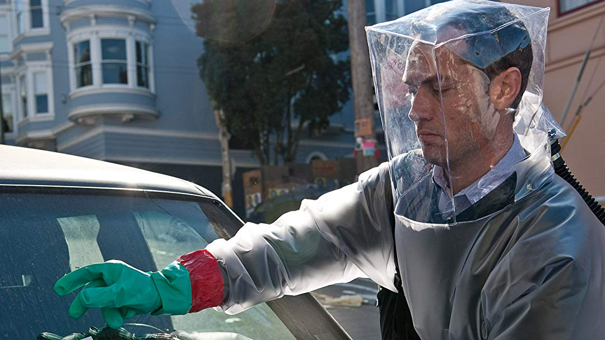

With the coronavirus probably hitching a ride in one of your co-workers, it’s possible that your work (especially if you exist in that oh-so-nebulous world of knowledge work) is implementing a more permissive remote work policy. 

Many of you will think “I can’t do that.” Many of you might be right, since a lot of very real, outcome-driving work happens in the interstitial space between “actual work” and socializing.  But I would suggest that there is a  balance to be struck that will allow you to work remotely or mostly remotely, thereby reducing your risk of exposure (or at least [flattening the curve](https://www.vox.com/science-and-health/2020/3/6/21161234/coronavirus-covid-19-science-outbreak-ends-endemic-vaccine) so that local healthcare systems don’t get overwhelmed).

I’ve been working mostly remotely since mid 2017, when I realized with a bit of a shock that the fellowship I had accepted was for a remote team. Turns out it works out well, but oh my god, was the learning curve painful. Currently, I work mostly remotely as a product manager, a job that I would not have guessed would  fit that mode.

So here are a few tips on the remote work thing, with the goal of inspiring you to give it a try.

## Create an Accountability Structure
This is the biggest thing and also should be table stakes. Some folk have intense internalized accountability, and they might just get the work done because of fear, pride, whatever. I’m not one of those. I am both very goal-oriented and very exploration-motivated, so I’ll work frantically and gleefully, but my attention will turn on a dime without some accountability structure to keep it in place.

For me, what I found worked best was consistent deadlines and dramatic transparency about responsibilities. Every week I broadcast to the team my goals, deadlines, and expected outcomes as a baseline, and then run my team’s product specific standup. I also keep a lot of documentation. 90% of that isn’t read until it’s needed, or not at all, but the act of documenting helps makes things concrete, and it’s a motivator for me knowing its done and making it public to the team. Currently, I run the documentation with Notion, where I keep everything from year-scoped strategy, to feature specs and data models, to weekly notes and to-do lists.

## Over Communicate, but Not Like That
Language by itself is low bandwidth. The reason why face-to-face meetings are so vital is that trust is built through being in the room, showing openness, communicating physically, demonstrating emotion, taking risk, etc. There’s a lot communicated outside of just words. Unfortunately, one of those things might be coronavirus. So let’s compromise.

You can work remotely and still have high bandwidth communication. *What you shouldn’t do is be a sociopath on Slack*. Not everything needs to be liked, but communication and requests DO need to be acknowledged. Not everyone needs to see the gif, but sometimes a gif drives the point home. Basically, focus on the quality of your communication and the context that it creates, instead of becoming a one-human version of the PRC’s surveillance state.

A concrete example: your team’s engineer shares what she just pushed to staging, asking for feedback. You acknowledge and give a timeframe for feedback, so expectations are set. Somewhere in that time period, give it a look. Instead of just rambling off feedback in slack, make a list. Open a notes application (I use BearApp) or your issue tracking software, and make a list of what you’re seeing. Maybe take some screenshots, maybe record a screencast of a bug. Copy and paste your feedback (or links to the feedback) into a slack thread responding to the request, and tag the engineer in your response so she knows that the feedback is there. Probably you’ll have a discussion about it. Probably everything will move on easily.

In this case, the communication is focused, high quality, but also flexible enough to respond to the needs of the problem and is pretty damn fast. When so much of communication is performance, the thing you need to be “performing” when working remotely is competence and a focus on outcomes.

## Take Your Damn Breaks and Put On Some Pants

Once you get used to working remotely and find your stride, it can be very, very easy to suddenly wake up on the other side of the day with a brilliantly demolished to-do list, but no clothes and a hole where lunch was supposed to be.

I love the experience of being so engrossed in making something, I don’t even notice time and the world passing by. That’s gotten a bit less desirable now that I’m a parent (because I want to be spending that time with my son, frankly), but nonetheless it can be great feeling if you like and value your work. However, it can also be unhealthy and unsustainable.

When colocated with other workers (i.e. in an office), there is rarely continuous flow. You get up, you stretch, you get coffee, you run an errand, you get pulled into a brainstorm, you chat with a colleague about their weekend, you play foosball, you get your ass handed to you because you grew up in Canada without a foosball table and why are all the European designers so absurdly good at this game and ugh whatever. The work day has its core of work, but this core is supported by the daily conversations, rituals, and inefficiencies that being human brings with it.

Some folk use things like Pomodoro or “stand up” reminders to keep themselves on track. I occasionally use a countdown clock called a Time Timer if I need to do something that I desperately don’t want to do, but just needs to get done. It’s like a time prison. But mostly, I wouldn’t do that. Maybe set a reminder for yourself if you find you missed lunch once or twice. Make a point of getting up to get water, or treating yourself to lunch outside of the house. The point is to create rituals and habits, so that healthy breaks from your work are not only consistent but also so obvious as to be practically invisible.

## Be Aware of Dead Reckoning

Things slip. It’s just how it goes. With every decision, and action, a little bit of error is introduced into the system. With each subsequent action, a little bit more error is introduced, and over time, these errors compound and you’re not where you  thought you were. 

This is the essence of dead reckoning: a navigation technique that takes your previous position and estimates your current position based off of speed, travel time, etc. Except every position determined from dead reckoning is an estimate, not the truth. And so to reduce the error on that estimate, we need a way of identifying that “truth.” This cuts across the two big risks of remote work: 1) alignment with your team and stakeholders, and 2) actual delivery of value when outside of a co-located accountability structure. 

When we work outside of the co-located office, we lose the ease with which alignment can happen on a team working towards a common goal. This alignment certainly isn’t always correct, but it’s easier for the team mindset to take over. When working remotely, it’s easy to look at a low-bandwidth message on Slack or Microsoft Teams (which is terrible) and infer alignment from shared language used. But the mental model that you and your other conversant might hold can diverge pretty wildly, and lacking the added nuance of higher bandwidth modes of communication (like face-to-face, or as I like to call it, corona-close) the signal that you’re actually misaligned might not show up until it is too late. As a general rule, any time someone says “Great, we’re aligned on that” I take a minute to spell out exactly what it is that I’m doing next.

## Be Kind To Yourself
Finally, be kind to yourself and others who are trying remote work for the first time. It’s not going to be for everyone. It might suck, it might be awesome, but it’ll absolutely be different. Give yourself space to fail the first month or two, and be open about what’s working and not working with your colleagues. Please extend the same generosity of spirit to them as well, and experiment with different tools, processes, and similar until you find something that sticks. With my current team, we’ve been through three different tools and several rounds of iteration before we hit something that really feels comfortable.

Ultimately, this need to work remotely is coming from an inherent fragility in our existing ways of working. Flatter organizations and open office environments can certainly lead to a stronger network effect and more co-creation within organizations, but it also gets you Gweneth Paltrow in Contagion (which I’m guessing was cross-marketing for Goop?).

So I hope this helps. Don’t go too far down the productivity rabbit hole, but rather be reflective, be communicative, and be kind to yourself.

Also, if you’re looking for more on design and global affairs (like Coronavirus), subscribe to my newsletter [Diverge Weekly](https://divergeweekly.com), where we explore how design emerges around the world and how design impacts issues of health, security, trade, and climate.

Also wash your goddamn hands.
