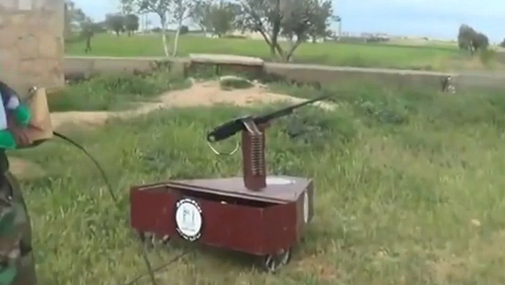

`[Image from Popular Science](https://www.popsci.com/technology/article/2013-05/ten-improvised-weapons-made-syrian-rebels/?image=8)`

Security and Innovation are described as going hand-in-hand. The logic is pretty simple: existential threats spur on unconventional allocation of resources towards R&D to outpace the enemy at the national level, and lack of resources and necessity drives improvisation and innovation on the ground.

But how does it actually happen? In today’s asymmetric conflicts, we’ve seen terrifying effective innovations in IEDs, remote controlled weapons platforms, and conventional arms in the form of home-modified pickup trucks, drones with grenades, AK47 turrets controlled with a playstation controller, or even rudimentary autonomous weapons platforms.

## Overall Question

Is there a recurring model of TECHNICAL and MANAGEMENT innovation within non-state war-fighting and/or terrorist organizations that use violence to achieve political ends that facilitates these observable innovations? Are there consistent and descriptive models of technical and management problem solving across orgs like AQI, the IRA, ISIS, the FSA, etc?

What commonalities, advantages, disadvantages does this model have when compared with models of innovation within conventional war-fighting organizations? How might such models might be compared. Additionally, who are the catalysts and maintainers of these innovation cycles, and does this frame on value and innovation change our understanding of who catalyzes what in these organizations? What kinds of traits to these individuals share with other innovators in the private sector, academia, and government?

## Why this Topic?

I’ve been fascinated by the remote gun platforms coming out of Syria and ISIS-occupied Mosul in Iraq. I come from a “maker” background, building music and art with electronics and software that ultimately turned into a career in innovation and design. But those same skills that I learned at art galleries or self-taught online are being applied in conflict zones. I will explore how and if there are consistent and observable ways that these innovations are created, disseminated, and scaled within organizations, eg. In the SVBIED “factory” that ISIS set up in Mosul.

## Why Me?

Despite a political science undergrad degree, I’ve been working in technology for a decade as a designer and software maker. I’ve run startups, consult in innovation, and have a lot of experience as a management consultant. I always look for these cycles and loops within the systems I explore, and have done a fair bit of reading on systems thinking/theory (eg. Donna Meadows, John Boyd, and more contemporary design thinking work) . In this case, I want to do this research based off of the artifacts of the organizations instead of directly observing it as a consultant, employee, or ethnographer. Also more broadly, I’ve always been interested in the path dependence that seems to take place in the innovation capacity of a business relative to its structure. I wonder if the same can be said and explored within these more networked, clandestine orgs.

## Research Methods

I'm a bit less confident on the appropriate meth. I seek to leverage databases like [Westpoint’s Harmony DB](https://ctc.usma.edu/harmony-program/) (captured and translated management literature from terror orgs, especially AQI) and mimic some of the methodologies that Jacob Shapiro describes in [The Terrorist’s Dilemma](https://press.princeton.edu/books/hardcover/9780691157214/the-terrorists-dilemma). I also intend to heavily mine and code social media content from YouTube, twitter, reddit, etc. to try and trace individual instances to point to timelines of “innovation” moving across groups.

I intend to capitalize on a starting point provided by an unclassified US Army report on remote and tele-operated weapons, and there are forums like Reddit's [/r/ShittyTechnicals/](https://www.reddit.com/r/shittytechnicals) which has the occasional gem. In addition, arms researchers like CalibreObscura have used methodologies that may be borrowed. It is unlikely that I will be able to do individual interviews with current/former combatants for clearance reasons.

## Anxiety

Doing this research in the international security studies context and still following the theoretical framing we’ve been introduced to so far. I’m committed to take an empirical an approach as I can to this, but also want to present a perspective on what to do about it. How these innovation shift power relationships and WHO serves to drive those innovations forward: so similar to the narrative around venture capital and entrepreneurs who want to change the world, is it inevitable that the funders and political leadership will always drive the application of these innovations?
